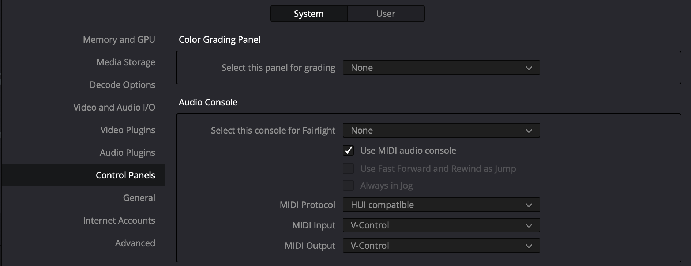

# DaVinci Resolve

* In the Resolve top menu bar select: DaVinci Resolve / Preferences...
* In the Preferences window, select "Control Panels"
* In the Audio Console section, enable "Use MIDI audio console".
* Setup with with the following settings:
    * MIDI Protocol: HUI compatible
    * MIDI Input: V-Control
    * MIDI Output: V-Control

