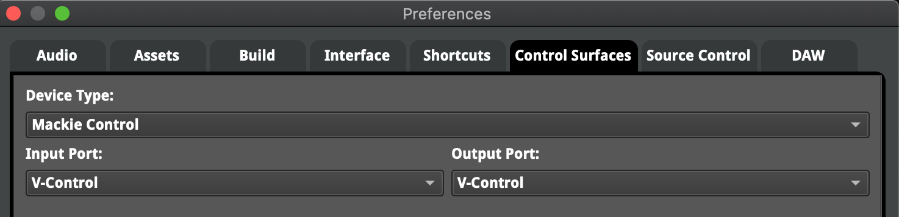
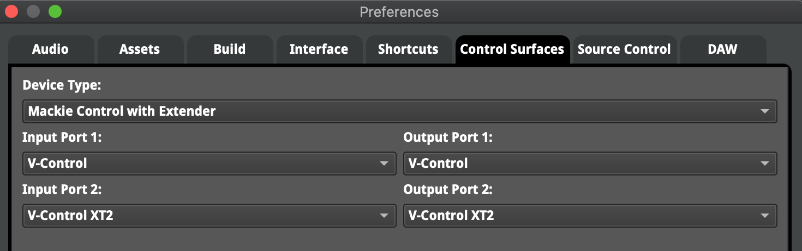

# FMOD Studio

## 8 Channel 

* In the FMOD Studio top menu bar select: FMOD Studio / Preferences...
* In the Preferences window, select the Control Surface tab.
* Select the following for an 8 channel surface:
    * Device Type: Mackie Control
    * Input Port: V-Control
    * Output Port: V-Control
    * FMOD Mackie 1

## 16 Channel

Select the following for an 16 channel surface:

* Device Type: Mackie Control with Extender
* Input Port: V-Control
* Output Port: V-Control
* Input Port 2: V-Control XT2
* Output Port 2: V-Control XT2
* FMOD Mackie 1

