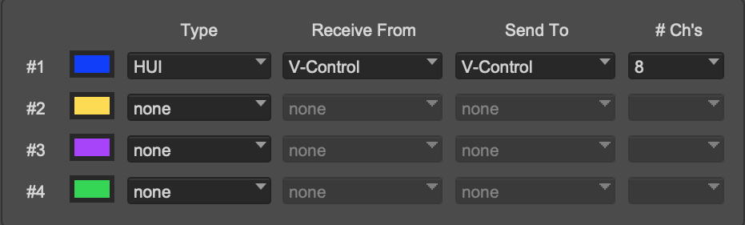
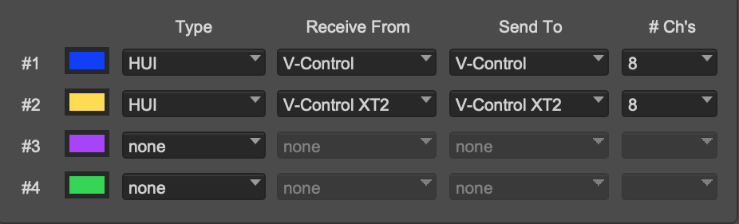
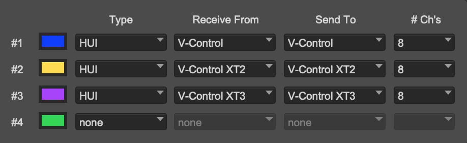
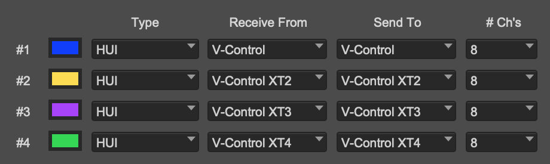
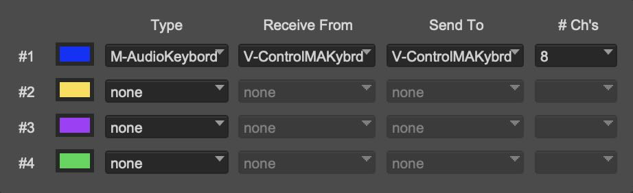
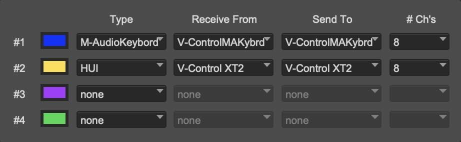

# Setting Up Pro Tools

V-Control Pro uses the HUI protocol with Pro Tools Studio/Ultimate to provide for 8, 16, 24, or 32 channels of control. The Pro Tools Midi Peripherals window must be configured to use V-Control Pro's virtual Midi ports for Pro Tools to communicate with V-Control Pro.

!!! warning "Enable Midi Ports In Pro Tools"
    V-Control Pro provides virtual Midi ports for Pro Tools to use. These ports must be enabled for Midi input.

!!! warning "FaderPort 8/16 With Pro Tools 2022 And Earlier"
    FaderPort 8/16 setup depends upon which version of Pro Tools you are using. Please see the special setup information for FaderPort 8/16 with Pro Tools 2022 and earlier.

## Enable V-Control Pro Virtual Midi Ports

* In Pro Tools, select the menu Setup / MIDI / MIDI Input Devices
* Enable the <b>V-Control, V-Control XT-2, V-Control XT-3, V-Control XT-4</b> and <b>V-Pan</b> ports.
* Do not enable the <b>V-Control Midi Mode</b> port.

## Setting the Midi Peripherals

V-Control Pro must be set up in the Pro Tools peripherals window. Depending on how many banks are being used, the configuration will vary. 

* In the Pro Tools top menu bar select: Setup / Peripherals. Select the MIDI Controllers tab

### 8 Channel Surfaces

* D-Command Main
* Pro Control Main
* FaderPort 8 (Pro Tools 2023+)
* Digidesign 003
* V-Console (set for 8 channels)
* Legacy V-Control Pro iPad App

### 16 Channel Surfaces

* Pro Control Main & Pro Control FaderBank
* FaderPort 16 (Pro Tools 2023+)
* V-Console (set for 16 channels)

### 24 Channel Surfaces

* D-Command Main & D-Command Fader Module
* Control 24
* C24
* Pro Control Main & Two Pro Control FaderBanks
* RAVEN 24

### 32 Channel Surfaces
* Pro Control Main & Three Pro Control FaderBanks
* FaderPort V2 / ioStation 24c
* RAVEN 32

### FaderPort 8 With Pro Tools 2022 And Earlier

### FaderPort 16 With Pro Tools 2022 And Earlier

