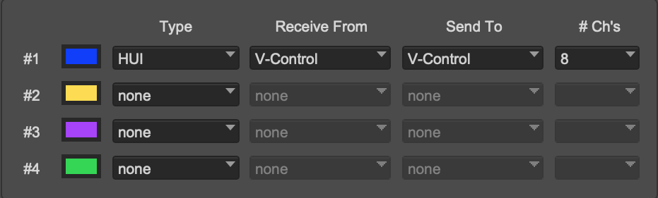
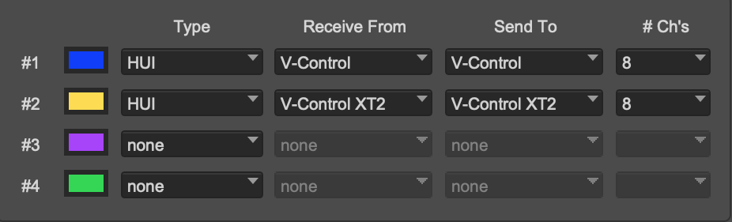
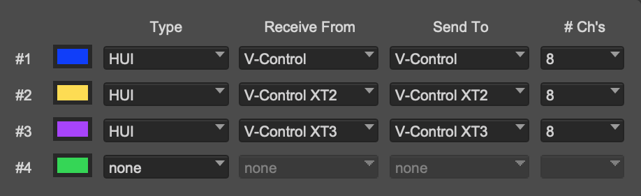
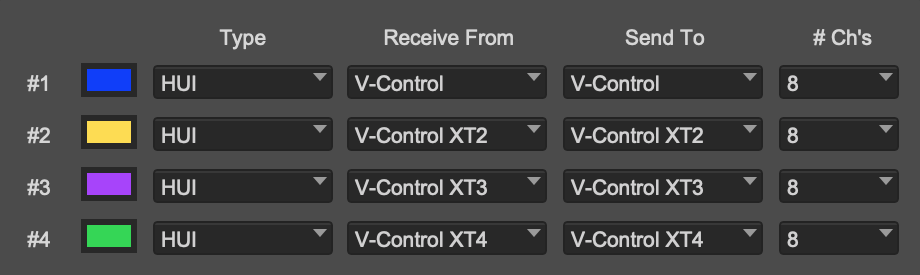
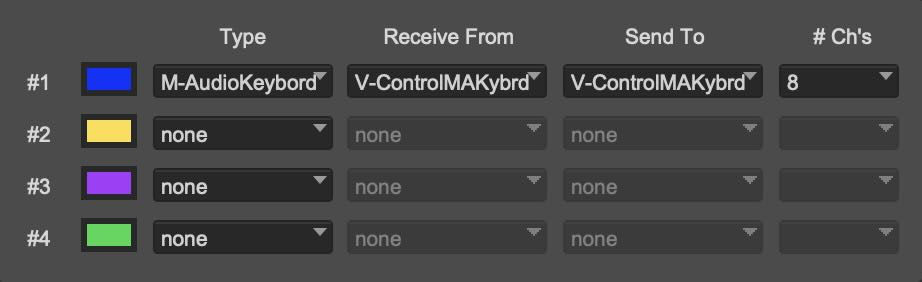
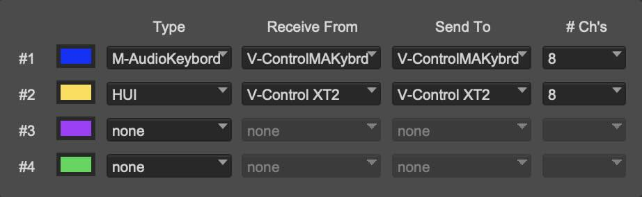

# Setting Up Pro Tools

!!! warning "Important HUI Metering Information"
    The HUI protocol provides for stereo track metering. It does not provide for output metering. Surfaces that have output meters will not display any output metering when connected to Pro Tools.

    Pro Tools will not provide track metering if Eucon is enabled. Info to disable Eucon for HUI track metering is [HERE](#disable-enable-eucon) 

V-Control Pro uses the HUI protocol with Pro Tools Studio/Ultimate to provide for 8, 16, 24, or 32 channels of control. The Pro Tools MIDI Peripherals window must be configured to use V-Control Pro's virtual MIDI ports for Pro Tools to communicate with V-Control Pro.

!!! warning "Do Not Enable Ethernet Legacy Controllers In Pro Tools"

!!! warning "Enable MIDI Ports In Pro Tools"
    V-Control Pro provides virtual MIDI ports for Pro Tools to use. These ports must be enabled for MIDI input.

!!! warning "FaderPort 8/16 With Pro Tools 2022 And Earlier"
    FaderPort 8/16 setup depends upon which version of Pro Tools you are using.
    
    You must use V-Control Pro 3.0.X.

    Please see the special setup information for FaderPort 8/16 with Pro Tools 2022 and earlier.

## Enable V-Control Pro Virtual MIDI Ports

* In Pro Tools, select the menu `Setup / MIDI / MIDI Input Devices`
* Enable the `V-Control, V-Control XT-2, V-Control XT-3, V-Control XT-4` and `V-Pan` ports.
* If using FaderPort 8/16 with Pro Tools 2022 or earlier, enable the `V-Control MA Keyboard` port.
* Do not enable the `V-Control MIDI Mode` port.

## Setting the MIDI Peripherals

V-Control Pro must be set up in the Pro Tools peripherals window. Depending on how many banks are being used, the configuration will vary.

* In the Pro Tools top menu bar select: `Setup / Peripherals`. Select the MIDI Controllers tab

### 8 Channel Surfaces

* D-Command Main
* ProControl Main
* FaderPort 8 (Pro Tools 2023+)
* Command 8
* Digidesign 003
* V-Console (set for 8 channels)
* Legacy V-Control Pro iPad App

### 16 Channel Surfaces

* ProControl Main & ProControl Fader Pack
* FaderPort 16 (Pro Tools 2023+)
* V-Console (set for 16 channels)

### 24 Channel Surfaces

* D-Command Main & D-Command Fader Module
* Control 24
* C24
* ProControl Main & Two ProControl Fader Packs
* RAVEN 24

### 32 Channel Surfaces
* ProControl Main & Three ProControl Fader Packs
* FaderPort V2 / ioStation 24c
* RAVEN 32

### FaderPort 8 With Pro Tools 2022 And Earlier (requires V-Control Pro 3.0)

### FaderPort 16 With Pro Tools 2022 And Earlier (requires V-Control Pro 3.0)

## Disable / Enable Eucon

Pro Tools will not provide HUI track metering if Eucon is enabled. Disable Eucon for HUI track metering. If you need to use Eucon, enable it but understand that HUI track metering will not work due to a bug in Pro Tools.

### Method 1 - Newer Pro Tools versions

* Open a Pro Tools session.
* Click the Edit Window Toolbar menu (the gear icon in the upper-right corner of the Edit window) or right-click the toolbar.
* Select EUCON from the drop-down menu.The EUCON controls will now appear on your toolbar. * Click the EUCON button so it is highlighted green with black text to enable it.

### Method 2: Newer Pro Tools versions

* Go to the top menu and select Setup > Peripherals.
* Click on the Ethernet Controllers tab.
* Check / uncheck the box for Enable EUCON.
* Ensure no specific Ethernet Port is selected in the box below it (leave it unselected/blank).
* Click OK