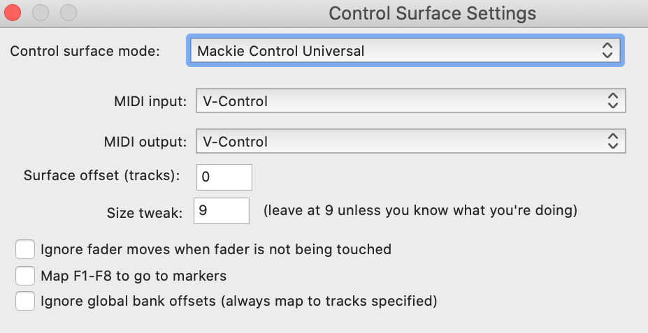

# Reaper

V-Control Pro must be set up in the Control/OSC/Web section of the Preferences window. Depending on how many banks are being used, the configuration will vary.  At this time functionality is very limited with Reaper.

## 8 Channel

- Launch Reaper
- In the Reaper top menu bar go to: Reaper / Preferences...
- Navigate to the Control/OSC/Web section of the Preferences window.
- Click on Add to bring up the Control surface setup window.
- Select the following in the Control Surface Settings Window:
    - Control Surface Mode: Mackie Control Universal
    - MIDI Input: V-Control
    - MIDI Output: V-Control

## 16 Channel

Follow the instructions for 8 Channel setup then do the following:

- Click on Add again to bring up a new window:
- Select the following in the Control Surface Settings Window to add the 2nd bank:
    - Control Surface Mode: Mackie Control Extender
    - MIDI Input: V-Control XT2
    - MIDI Output: V-Control XT2
    - Surface Offset (Tracks): 8

## 24 Channel

Follow the instructions for 16 Channels then do the following:

- Click on Add again to bring up a 3rd new window:
- Select the following in the Control Surface Settings Window to add the 3rd bank:
    - Control Surface Mode: Mackie Control Extender
    - MIDI Input: V-Control XT3
    - MIDI Output: V-Control XT3
    - Surface Offset (Tracks): 16

