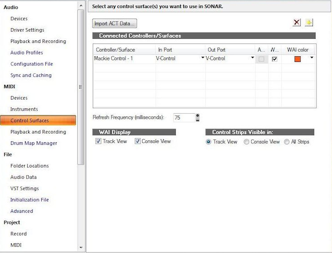

# Sonar

* In the Sonar top menu bar go to: Edit / Preferences / Control Surfaces...
* Configure for Connected Controllers/Surfaces as follows:
    * Controller/Surface: Mackie Control
    * In Port: V-Control
    * Out Port: V-Control

