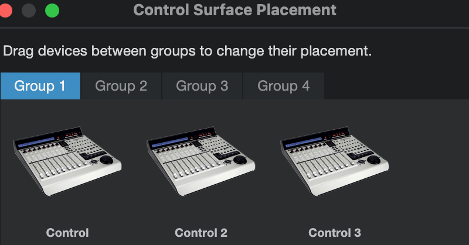

# Studio One / Fender Studio

V-Control Pro must be set up in the External Devices window in the Studio One / Fender Studio Preferences.  Depending on how many banks are being used, the configuration will vary. Each bank is 8 channels.

## 8 Channel Surfaces

If your surface is a Command 8, D-Command Main with no fader modules, a single Pro Control device, or other 8-channnel surface, you must add one Mackie Control bank as described here.

- Launch Studio One / Fender Studio
- In the Studio One / Fender Studio top menu bar select: Studio One-Fender Studio / Preferences...
- Select External Device on the preferences window
- Select "Add Device" and choose the following:
    - Mackie/Control
    - Receive From: V-Control
    - Send To: V-Control

## 16 Channel Surfaces

If your surface is two Pro Control devices or other 16-channnel surface, you must add two Mackie Control banks as described here.

Follow instructions for 8 Channel setup, then add the following:

- Select “Add Device” and choose the following:
    - Mackie/Control
    - Receive From: V-Control XT2
    - Send to: V-Control XT2

- Rename the 2nd controller by selecting it and clicking on Edit…

!!! note "Ignore `Please select Mackie...` Instructions"
    You can safely ignore the Studio One instructions to `Please select Mackie Control operating mode...` V-Control Pro will automatically use Mackie Control protocol.

## Group Placement For 16 Channels

For a 16-channel surface you will have configured two Mackie banks above. But by default, Studio One will have placed them in separate `Groups.` You must configure them into one `Group` so that they will behave as a single, wide surface. This is done with Studio One's Placement configuration.

- Click `Placement`
- Click `Group 2` then click and drag the Mackie MCU device to `Group 1.`

## 24 Channel Surfaces

If your surface is a Control 24, C24, D-Command Main + Fader Module, three Pro Control devices or other 24-channnel surface, you must add three Mackie Control banks as described here.

Follow instructions for the 8 and 16 Channel setup, then add the following:

- Select "Add Device" and choose the following:
- Mackie/Control
- Receive From: V-Control XT3
- Send To: V-Control XT3

- Rename the 3rd controller by selecting it and clicking Edit...

!!! note "Ignore `Please select Mackie...` Instructions"
    You can safely ignore the Studio One instructions to `Please select Mackie Control operating mode...` V-Control Pro will automatically use Mackie Control protocol.

## Group Placement For 24 Channels

For a 24-channel surface you will have configured three Mackie devices above. But by default, Studio One will have placed them in separate `Groups.` You must configure them into one `Group` so that they will behave as a single, wide surface. This is done with Studio One's Placement configuration.

- Click `Placement`
- Click `Group 2` then click and drag the Mackie MCU device to `Group 1.`
- Click `Group 3` then click and drag the Mackie MCU device to `Group 1.`

## 32 Channel Surfaces

If your surface is four Pro Control devices or other 32-channnel surface, you must add four Mackie Control banks.

Follow instructions for the 24 Channel setup and add a fourth device using the V-Control XT3 port.