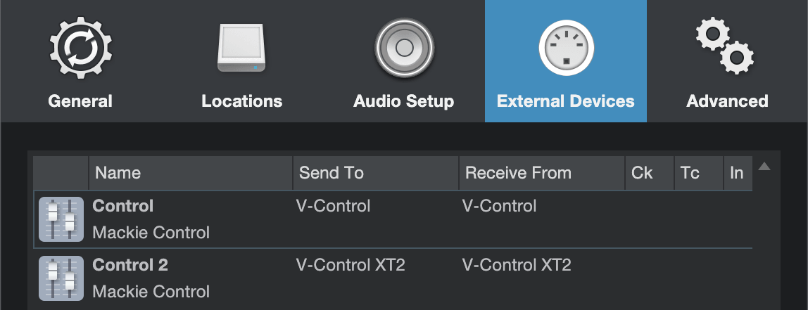

# Studio One

V-Control Pro must be set up in the External Devices window in the Studio One Preferences.  Depending on how many banks are being used, the configuration will vary.

## 8 Channel Surfaces

- Launch Studio One
- In the Studio One top menu bar select: Studio One / Preferences...
- Select External Device on the preferences window
- Select "Add Device" and choose the following:
    - Mackie/Control
    - Receive From: V-Control
    - Send To: V-Control

## 16 Channel Surfaces

Follow instructions for 8 Channel setup, then add the following:

- Select “Add Device” and choose the following:
    - Mackie/Control
    - Receive From: V-Control XT2
    - Send to: V-Control XT2

(Optional) Rename the 2nd controller by selecting it and clicking on Edit…
Click on Placement and drag the devices

Click on Placement and drag the devices from the Ungrouped section to Grouped in the desired configuration:

## 24 Channel Surfaces

Follow instructions for the 8 and 16 Channel setup, then add the following:

- Select "Add Device" and choose the following:
- Mackie/Control
- Receive From: V-Control XT3
- Send To: V-Control XT3

(Optional) Rename the 3rd controller by selecting it and clicking Edit..

Click on Placement and move the controllers from the Ungrouped section to the Grouped section in the desired configuration.

