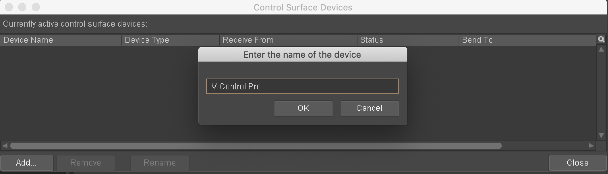
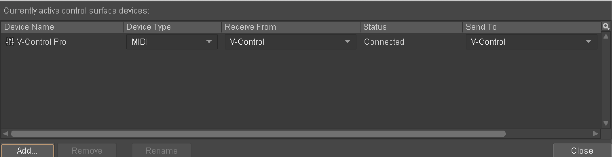

# Wwise

* In the Wwise top menu bar select: Project / Control Surface Devices
* Click on "Add.." in the Control Surface Devices Window
* In the Wwise top menu bar select: Project / Control Surface Devices
* Type out a name for device being used with V-control Pro.

* In the Wwise top menu bar select: Project / Control Surface Devices
* In the Wwise top menu bar select: Project / Control Surface Devices
* Set the settings of the device as shown:
    * Device Type: Mackie Control
    * Receive From: V-Control
    * Send To: V-Control

